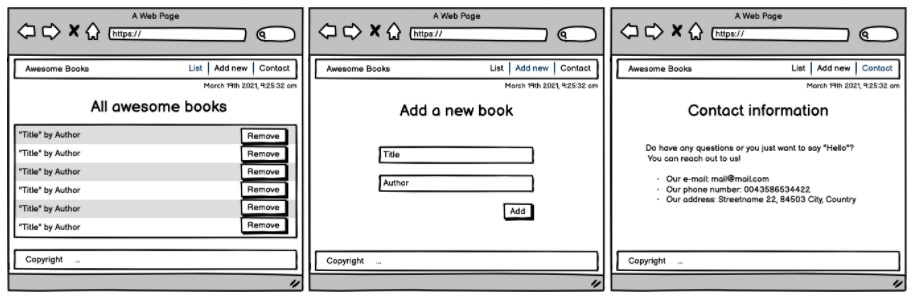

# Awesome Books

> A simple library for you to save a list of your favorite books.

## Live Demo
[Awesome Books](https://nizamuddin4493.github.io/Awesome-Books/)

## Run the Project Locally
- To Clone the Project Locally Please click the following link.
- [Awesome Books](https://github.com/Nizamuddin4493/Awesome-Books)
- The click on Green Code button
- Copy the SSH link and clone it Locally through your Code Editor's terminal.

## Built With

- HTML
- CSS
- JavaScript

## Authors

👤 **Nizamuddin Ahmadzai**

- GitHub: [@Nizamudin4493](https://github.com/Nizamuddin4493)
- Twitter: [@Nizamudin4493](https://twitter.com/Nizamuddin4493)
- LinkedIn: [nizamuddin4493](https://linkedin.com/in/nizamuddin4493)

👤 **Fernando Silva**

- GitHub: [@Fernando](https://github.com/fernando-silvabr66)
- Twitter: [@Fernando](https://twitter.com)
- LinkedIn: [Fernando](https://linkedin.com)

## 🤝 Contributing

Contributions, issues, and feature requests are welcome!

Feel free to check the [issues page](https://github.com/Nizamuddin4493/Awesome-Books/issues).

## Show your support

Give a ⭐️ if you like this project!

## Acknowledgments

- Hat tip to our code reviewers on Microverse

## 📝 License

This project is [MIT](./MIT.md) licensed.
